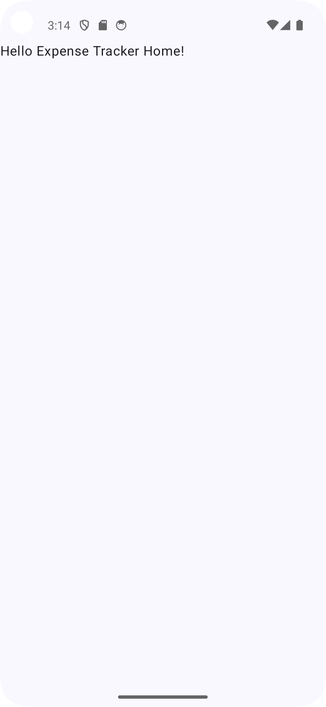

# ExpenseTracker

Application Android de suivi des dépenses.

## À propos du projet

ExpenseTracker est une application Android permettant de suivre ses dépenses quotidiennes.

L'objectif est de faciliter l'enregistrement, la modification et la suppression des dépenses afin de mieux suivre ses dépenses personnelles.

## Fonctionnalités

- Ajouter une dépense
- Modifier une dépense
- Supprimer une dépense

## Technologies

- Kotlin
- Jetpack Compose
- Material 3

## Prérequis

- Android Studio
- Android SDK 37
- JDK 17 ou version ultérieure

## Installation et exécution

1. Cloner le dépôt
2. Ouvrir le projet dans Android Studio
3. Laisser Gradle synchroniser le projet
4. Sélectionner un émulateur ou un appareil android
5. Executer l'application

## Aperçu

